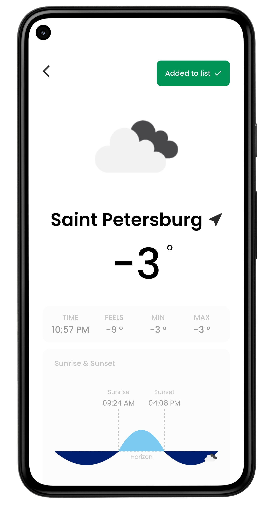

<p align="center">
  
</p>

<h1 align="center">Weather</h1>

<p align="center">
  Cordova app for weather
</p>

## Table Of Contents

- [Try It Online](#try-it)
- [Download](#download)
- [Template](#template)
- [Utils](#utils)
- [Technology Stack](#technology-stack)
  - [App](#app)
  - [Api](#api)
- [How To Start](#how-to-start)
- [How To Build](#how-to-start)
  - [Web](#web)
  - [Android](#android)
  - [Api Server](#api-server)
- [Environment Variables Description](#environment-variables-description)
  - [App Variables](#app-variables)
  - [Api Variables](#api-variables)
- [Screenshots](#screenshots)
  - [Home](#home)
  - [Search](#search)
  - [City Page](#city-page)
- [License](#license)

## Try It Online

At Vercel: https://trequend-weather.vercel.app

## Download

At Android: [apk](https://github.com/Trequend/weather/releases/download/v1.1.0/weather.apk)

## Template

At Figma: [Minimal Weather App](https://www.figma.com/community/file/1019097765306863573)

## Utils

- Yarn workspaces
- ESLint
- Commitlint
- Prettier
- Husky

## Technology Stack

### App

- TypeScript
- Cordova
- React
- Redux
- CSS Modules

### Api

- TypeScript
- Nest.js
- Fastify
- RxJS
- MongoDB

## How To Start

Recommended editor: `Visual Studio Code`

Required tools:

- Git
- Node.js
- Yarn

Download project:

```bash
git clone https://github.com/Trequend/fancywork.git
cd fancywork
```

Install dependencies:

```bash
yarn install
```

Create `.env` file from `.env.example` in app folder and fill it. [Environment variables description](#environment-variables-description).

Start application:

```bash
yarn workspace com.trequend.weather run start
```

Create `.env` file from `.env.example` in api folder and fill it. [Environment variables description](#environment-variables-description).

Start api:

```bash
yarn workspace api run start-dev
```

## How To Build

Required tools:

- Git
- Node.js
- Yarn

Download project:

```bash
git clone https://github.com/Trequend/fancywork.git
cd fancywork
```

Install dependencies:

```bash
yarn install
```

### Web

Create `.env` file from `.env.example` in app folder and fill it. [Environment variables description](#environment-variables-description).

Build website:

```bash
yarn workspace com.trequend.weather run build
```

### Android

Install Cordova:

```bash
npm install -g cordova
```

Open app folder:

```bash
cd app
```

Add android platform:

```bash
cordova platform add android
```

Check requirements:

```bash
cordova requirements
```

Install missing dependencies.

Create `.env` file from `.env.example` in app folder and fill it. [Environment variables description](#environment-variables-description).

Build apk:

```bash
cordova build --release android
```

Sign the apk.

### Api Server

Create `.env` file from `.env.example` in api folder and fill it. [Environment variables description](#environment-variables-description).

Build:

```bash
yarn workspace api run build
```

## Environment Variables Description

### App Variables

`REACT_APP_API_URL`: api url

---

### Api Variables

`MONGO_URL`: mongodb connection url (default: mongodb://localhost:27017)

`MONGO_DB_NAME`: database name (default: weather)

`OPEN_WEATHER_KEY`: openweathermap api key

---

## Screenshots

<h3 align="center">Home</h3>

<p align="center">
  
</p>

<h3 align="center">Search</h3>

<p align="center">
  
</p>

<h3 align="center">City Page</h3>

<p align="center">
  
</p>

## License

MIT

Logo icon made by <a href="https://www.freepik.com" title="Freepik">Freepik</a> from <a href="https://www.flaticon.com/" title="Flaticon">www.flaticon.com</a>
